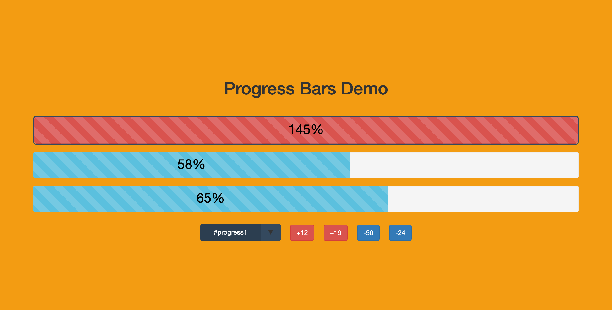
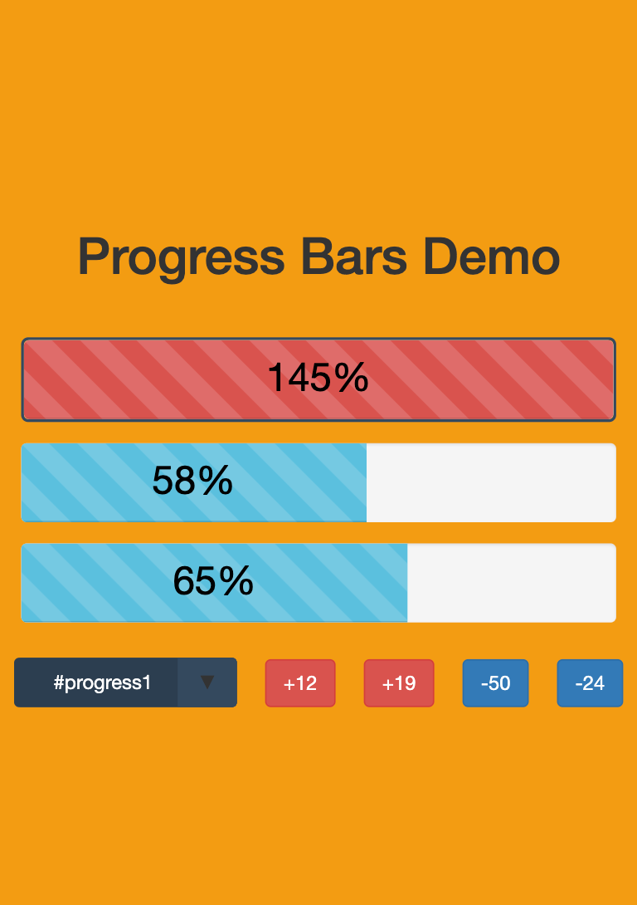

# progress-bar

## Introduction

This is a progress-bar app with some animation. All the bar status and button values are fetched from endpoint. Therefore, the data will be vanished once refresh the page.

**Website:** https://dynamic-bars.herokuapp.com

## Discription

The mainly tools have been used in this App are **React, Webpack and bootstrap**. React remains all the data states, which will be altered when click event is triggering. Webpack helps to pack all the html, css, scss and js file, and compress them to a smaller version. Finally, Bootstrap gives this App a responsive layout.

## ScreenShot

<p align="center"></p>

<p align="center"></p>

## Deploy

Firstly, clone this repository to local by running:
```javascript
git clone https://github.com/SmilingCode/progress-bar.git
```

Secondly, make sure you get all the package in the **package.json**(both dependencies and devDependencies)
```javascript
npm install --save <packageName>
npm install --save-dev <packageName>
```

**shortcut:**
```javascript
npm install
```

Lastly, run the command line
```javascript
npm run start
```

A **dist** folder will be generated in the root path, then click into the dist folder to see the full page.
END!
